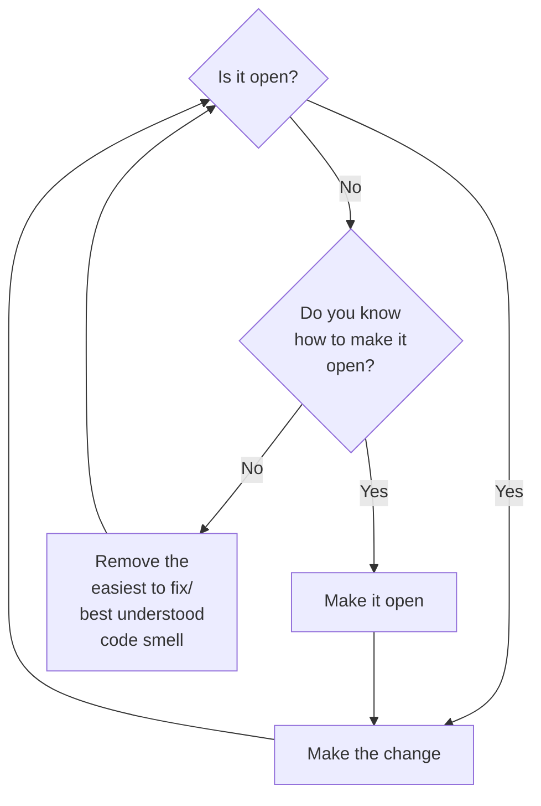

# 99 bottles

1.2 Judging code
You have internal rules about code you follow

1.2.1 evaluating code based on opinion
good code: highest value for lowest cost

1.2.2 evaluating code based on facts
metrics
loc
cyclomatic complexity -> how many branches
ABC -> assignment, branches, and conditionals
  Flog


Metrics are fallible but human opinion is no more precise. Checking metrics regularly will keep you humble and improve your code.

1.23
Shameless green for now

Code that’s good enough when nothing ever changes may not be good enough when things do

2 Testing shameless green

2.1

getting to green tests quickly is often at odds with writing perfectly changeable code.

2.2 Writing the first test

A walkthrough of TDD, write the test, then make the change to make the test pass
using TDD you get a string as the first verse(most easy way to make pass)

2.3 removing duplication

We may be temped to jumping to the abstraction that solves multiple cases, and thats ok, but its important to be able to articulate intermediate TDD steps of everything solves the problem at hand

2.4 tolerating duplication

DRY is important, but if applied too early or with too much vigor, it  does more harm than good

- Does the change make the code harder to understand?
- What is the future cost of doing nothing now?
- When will I have better information?

2.5 Hewing to the plan

express the unambiguous abstractions but avoid grasping for the not-quite visible ones

Readers of case statements expect conditions to be fundamentally the same.

sliding scale of concreteness/understandability <------------->abstractness/reusability

2.6 Exposing responsibilities

Duplication is useful when it supplies independent, specific examples of a general concept that you don’t yet understand.

Duplication is not helpful when it repeats known independent examples

2.7 choosing names

choose public interface of classes in a way that makes sense to senders of messages and reduces knowledge required of sending classes

2.8 Revealing Intentions
The distinction between intention and implementation allows you to understand a computation first in essence and later in detail if needed

2.9 writing cost effective tests

When tests are tied too closely to code, every change in code engenders a change in test

2.10 avoiding echo chamber

bottles = Bottles.new
3 assert_equal bottles.verses(99, 0), bottles.song

the song test is coupled to the current Bottles implementation such that it will break if the signature or behavior of verses changes, even if song continues to return the correct lyrics.

Best test is test WHOLE SONG as expectation

2.11 Considering Options
- Tie to bottles : Bad, can provide right output but test breaks if still working
- Tie to dynamically generated string ... duplicate verses logic
- Duplicate whole string BEST hard to convince self

2.12 Summary

Code can be most cost effective if it is not clever or extensible but is easy to understand, cheap to write, and requirements don't change.

## 3 Unearthing concepts

Shameless green: fast, clean good enough if no change.

### 3.1 listening to change

Most cost effective code is as good as necessary, no better
Programmers love elegant code, but improving on aesthetics is wasteful: Let change be driven by requirements,

New requirement: users have requested that you alter the 99 Bottles code to output "1 six-pack" in each place where it currently says "6 bottles.

current state

```ruby
class Bottles
def song
  verses(99,0)
end

def verses(upper, lower)
 upper.downto(lower).collect {|i| verse(i)}.join("\n")
end
def verse(number)
  case number
    when 0
      "No more bottles of beer on the wall, " + "no more bottles of beer.\n" +
      "Go to the store and buy some more, " + "99 bottles of beer on the wall.\n"
    when 1
      "1 bottle of beer on the wall, " +
      "1 bottle of beer.\n" +
      "Take it down and pass it around, " + "no more bottles of beer on the wall.\n"
    when 2
      "2 bottles of beer on the wall, " +
      "2 bottles of beer.\n" +
      "Take one down and pass it around, " + "1 bottle of beer on the wall.\n"
    else
      "#{number} bottles of beer on the wall, " + "#{number} bottles of beer.\n" +
      "Take one down and pass it around, " + "#{number-1} bottles of beer on the wall.\n"
    end
  end
end
```

Only 6 => 1 6 pack, not 12 => 2 6 packs, clarify requirements, write necessary minimum
Request for change is license to improve old code

If we wanted to follow above would need to add case statement for 6.. conditionals breed conditionals

### 3.2 open closed

Code is open to a new requirement when you can meet that new requirement without changing existing code.
Code open to new requirement ? Make change : refactor

SOLID

S - Single Responsibility
The methods in a class should be cohesive around a single purpose.
O - Open-Closed
Objects should be open for extension, but closed for modification.
L - Liskov Substitution
Subclasses should be substitutable for their superclasses.
I - Interface Segregation
Objects should not be forced to depend on methods they don’t use.
D - Dependency Inversion
Depend on abstractions, not on concretions.

you should not conflate the process of moving code around, of refactoring, with the act of adding new features.
You should instead separate these two operations.
When faced with a new requirement, first rearrange the existing code such that it’s open to the new feature, and once that’s complete, then add the new code.

You need to refactor simple green to make adding verse easy. If you don't know how to do this, follow below flowchart



### 3.3 Recognizing Code Smells

Trick is to isolate and tackle one at a time
consider Jay Fields `Refactoring:Ruby`
Rather than worry about 'what smell', list the things you dislike

### 3.4 Identify point of attack

Current verse method contains a case statement with duplicated code.(duplication is easy low hanging fruit): Refactor verse to remove duplication

there is no direct connection between removing the duplication, and succeeding in making the code open to the six-pack requirement, BUT using this approach, don't need to know whole solution to advance

### 3.5 Refactoring Systematically

`Refactoring is the process of changing a software system in such a way that it does not alter the external behavior of the code yet improves its internal structure.`

Safe refactoring relies on tests
(AI is really good at genning tests that cover every code path)

if tests fail, you broke OR tests were flawed(very possible in systems that rely too much on callback/model behavior)
Tests can assert HOW things are done, not what is done.

If necessary, improve specs pre-refactor

### 3.6 Follow flocking rules

Templates represent distinct verse variants

#### Flocking Rules

1. Select the things that are most alike.
2. Find the smallest difference between them.
3. Make the simplest change that will remove that difference.

Changes to code can be subdivided into four distinct steps:

1. parse the new code
2. parse and execute it
3. parse, execute and use its result
4. delete unused code

Small changes => precise error messages

Change one line at a time, run tests after every change, if they break, make a better change (is this realistic?)

### 3.7 Converging on Abstractions

Encapsulate the concept that varies

If two concrete examples represent the same abstraction and they contain a difference, that difference must represent a smaller abstraction within the larger one. If you can name the difference, you’ve identified that smaller abstraction.

Often people understand the abstraction then solve it, this book focusses on taking small, iterative steps to discover it

in our verses , verse `else` and 2 are most similar, differing only in `bottle vs bottles(can reuse `number, number -1`)

```ruby
when 2
 "2 bottles of beer on the wall, " +
 "2 bottles of beer.\n" +
 "Take one down and pass it around, " + "1 bottle of beer on the wall.\n"
else
 "#{number} bottles of beer on the wall, " + "#{number} bottles of beer.\n" +
 "Take one down and pass it around, " + "#{number-1} bottles of beer on the wall.\n"
```

#### 3.7.2 simplifying hard problems

Make the 2 most alike identical, do so in a horizontal path i.e. ONLY making this change. It can be easy to get distracted by other possible refactorings.

Solving easy problems makes hard problems easier

What is underlying abstraction bottles vs bottle?

To make these two lines the same, you must name this concept, create a method named after the concept, and replace the two differences with a common message send.

General rule: name of at thing should be one level higher abstraction than thing itself


| Number | xxx?      |
|--------|-----------|
| 1      | bottle    |
| 6      | six-pack  |
| n      | bottles   |

concept => Container(unit too many levels above)

Having named concept, implement code

probably what we Need:

```ruby
def container(number)
  if number == 1
    "bottle"
  else
    "bottles"
  end
end

"#{number-1} #{container(number-1)} of beer on the wall.\n"
```

Changes 7 lines of code, for this problem, we could hold it all in our head, but real world problems are big, how often change code, many things break?

Make tiny changes, run tests after each

Because no change breaks the tests, the code can be deployed to production at any intermediate point.
Allows you to avoid accumulating a large set of changes and suffering through a painful merge

Changing to get tests passign 1 lint at a time.

These steps
```ruby
def container(number=:FIXME)
  "bottles"
end
```

use a placeholder for value. (This seems really dumb for this use case). Argument is often we have many callers and may need to add an arg to all of them.

Now we can either

- alter container to check the value of number and return "bottle" or "bottles," meaning
change the receiver
- alter the else branch to add the number argument to container message, meaning change the sender.

 expand the code in container to use number to decide which of "bottle" or "bottles" to return, as follows:

 ```ruby
def container(number=:FIXME)
  if number == 1
    "bottle"
  else
    "bottles"
  end
end
 ```

 Now change sender to pass new arg `"#{number-1} #{container(number-1)} of beer on the wall.\n"`

 Now remove `FIXME`

 At this point, 2 and else are identical as 

 ```ruby
 "#{number} bottles of beer on the wall, " +
"#{number} bottles of beer.\n" +
"Take one down and pass it around, " +
"#{number-1} #{container(number-1)} of beer on the wall.\n"
 ```
And can be collapsed in the case statement.

### 3.8

Sometimes the first step, refactoring to openness, requires such a large leap that it is not obvious how to achieve it. In that case, be guided by code smells. Improve code by identifying and removing smells, and have faith that as the code improves, a path to openness will appear.

Making existing code open to a new requirement often requires identifying and naming abstractions. Follow Flocking rueles.

1. Select the things that are most alike.
2. Find the smallest difference between them.
3. Make the simplest change that will remove that difference.


## 4, Horizontal refactoring

This chapter iteratively applies the Flocking Rules to the remaining special verses, and results in a single, more abstract, template that produces every possible verse.

### 4.1 Replacing Difference with Sameness

Now that verse 2 in else branch, 3 branches remain

```ruby
def verse(number)
  case number
  when 0
    "No more bottles of beer on the wall, " + "no more bottles of beer.\n" +
    "Go to the store and buy some more, " + "99 bottles of beer on the wall.\n"
  when 1
    "1 bottle of beer on the wall, " +
    "1 bottle of beer.\n" +
    "Take it down and pass it around, " + "no more bottles of beer on the wall.\n"
  else
    "#{number} bottles of beer on the wall, " +
    "#{number} bottles of beer.\n" +
    "Take one down and pass it around, " +
    "#{number-1} #{container(number-1)} of beer on the wall.\n"
  end
end
```

Of above, 1 and else most similar, go through the lines 1 by one removing difference

`"1 bottle of beer on the wall, "` => `"{number} bottle of beer on the wall, "` => 

Above change increases level of abstraction

`"#{number} #{container(number)} of beer on the wall, "  => `"#{number} #{container(number)} of beer on the wall, " `

Now 1 and else are the same in the first line. Apply same change line 2

### 4.2 Equivocating about names

Pharase 3 ` "Take it down and pass it around, " ` VS `"Take one down and pass it around, "` IT vs ONE

Options when names elude: take 5-10 min try your best, (my way), put a non-meaning i.e. foo to replace later(For me this makes interim logic harder) OR ask for help

```ruby
def pronoun(number)
  if number == 1
    "it"
  else
    "one"
  end
end
```

functionally equivalent to container

### 4.3 Deriving Names from responsibilities

phrase 4 difference

`"no more bottles of beer on the wall.\n"`VS `"#{number-1} #{container(number-1)} of beer on the wall.\n"`

"no more bottles of beer" is same, so effectively
Goal: change next small difference, NOT clump of differences, we've already captured bottles vs bottle

`"no more" VS "#{number-1}"`

Here, for the first time, one is a string and the other is code. However, it doesn’t matter what form the difference takes.
If each verse variant reflects a more general verse abstraction, then the differences between the variants must represent smaller concepts within that larger abstraction.

Column header technique

| Number | xxx?  |
|--------|-------|
| 99     | '99'  |
| 50     | '50'       |
| 1      | '1'        |
| 0      | 'no more'  |

^^ Quantity

### 4.4 Choosing meaningful defaults
