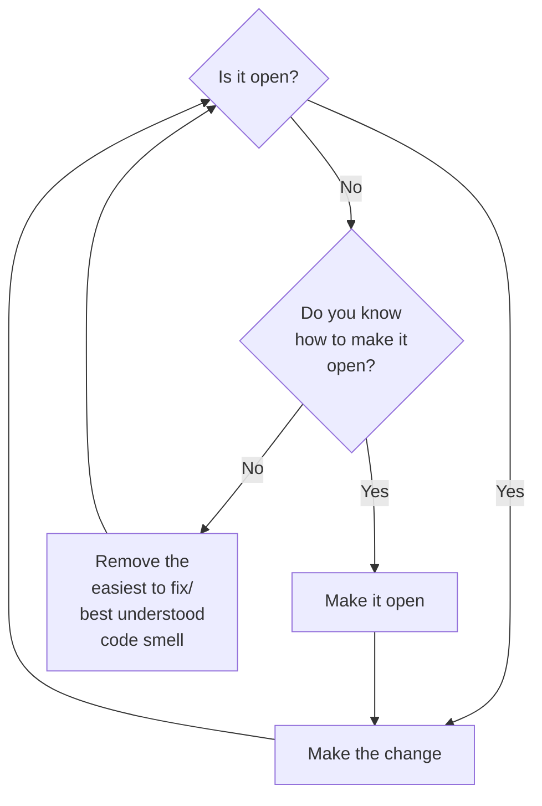

# 99 bottles

1.2 Judging code
You have internal rules about code you follow

1.2.1 evaluating code based on opinion
good code: highest value for lowest cost

1.2.2 evaluating code based on facts
metrics
loc
cyclomatic complexity -> how many branches
ABC -> assignment, brances, and conditionals
  Flog


Metrics are fallible but human opinion is no more precise. Checking metrics regularly will keep you humble and improve your code.

1.23
Shameless green for now

Code that’s good enough when nothing ever changes may not be good enough when things do

2 Testing shameless green

2.1

getting to green tests quickly is often at odds with writing perfectly changeable code.

2.2 Writing the first test

A walkthrough of TDD, write the test, then make the change to make the test pass
using TDD you get a string as the first verse(most easy way to make pass)

2.3 removing duplication

We may be temped to jumping to the abstraction that solves multiple cases, and thats ok, but its important to be able to articulate intermediate TDD steps of everything solves the problem at hand

2.4 tolerating duplication

DRY is important, but if applied too early or with too much vigor, it  does nore harm than good

- Does the change make the code harder to understand?
- What is the future cost of doing nothing now?
- When will I have better information?

2.5 Hewing to the plan

express the unambiguous abstractions but avoid grasping for the not-quite visible ones

Readers of case statements expect conditions to be fundamentally the same.

sliding scale of concreteness/understandability <------------->abstractness/reusability

2.6 Exposing responsibilities

Duplication is useful when it supplies independent, specific examples of a general concept that you don’t yet understand.

Duplication is not helpful when it repeats known independent examples

2.7 choosing names

choose pulic interface of classes in a way that makes sense to sendesrs of messages and reduces knowledge required of sending classes

2.8 Revealing Intentions
The distinction between intention and implementation allows you to understand a computation first in essence and later in detail if needed

2.9 writing cost effective tests

When tests are tied too closely to code, every change in code engenders a change in test

2.10 avoiding echo chanmber

bottles = Bottles.new
3 assert_equal bottles.verses(99, 0), bottles.song

the song test is coupled to the current Bottles implementation such that it will break if the signature or behavior of verses changes, even if song continues to return the correct lyrics.

Best test is test WHOLE SONG as expectation

2.11 Considering Options
- Tie to bottles : Bad, can provide right output but test breaks if still working
- Tie to dynamicly genreated string ... duplicate verses logic
- Duplicate whoele string BEST hard to convince self

2.12 Summary

Code can be most cost effective if it is not clever or extensible but is easy to understand, cheap to write, and requirements dont change.

## 3 Unearthing concepts

Shameless green: fast, clean good enough if no change.

### 3.1 listening to change

Most cost effective code is as good as necessary, no better
Programmers love elegant code, but improving on aesthetics is wasteful: Let change be driven by requirements,

New requirement: users have requested that you alter the 99 Bottles code to output "1 six-pack" in each place where it currently says "6 bottles.

current state

```ruby
class Bottles
def song
  verses(99,0)
end

def verses(upper, lower)
 upper.downto(lower).collect {|i| verse(i)}.join("\n")
end
def verse(number)
  case number
    when 0
      "No more bottles of beer on the wall, " + "no more bottles of beer.\n" +
      "Go to the store and buy some more, " + "99 bottles of beer on the wall.\n"
    when 1
      "1 bottle of beer on the wall, " +
      "1 bottle of beer.\n" +
      "Take it down and pass it around, " + "no more bottles of beer on the wall.\n"
    when 2
      "2 bottles of beer on the wall, " +
      "2 bottles of beer.\n" +
      "Take one down and pass it around, " + "1 bottle of beer on the wall.\n"
    else
      "#{number} bottles of beer on the wall, " + "#{number} bottles of beer.\n" +
      "Take one down and pass it around, " + "#{number-1} bottles of beer on the wall.\n"
    end
  end
end
```

Only 6 => 1 6 pack, not 12 => 2 6 packs, clarify requirements, write necessary minimum
Request for change is license to improve old code

If we wanted to follow above would need to add case stateent for 6.. conditionals breed conditionals

### 3.2 open closed

Code is open to a new requirement when you can meet that new requirement without changing existing code.
Code open to new requirement ? Make change : refactor

SOLID

S - Single Responsibility
The methods in a class should be cohesive around a single purpose.
O - Open-Closed
Objects should be open for extension, but closed for modification.
L - Liskov Substitution
Subclasses should be substitutable for their superclasses.
I - Interface Segregation
Objects should not be forced to depend on methods they don’t use.
D - Dependency Inversion
Depend on abstractions, not on concretions.

you should not conflate the process of moving code around, of refactoring, with the act of adding new features.
You should instead separate these two operations.
When faced with a new requirement, first rearrange the existing code such that it’s open to the new feature, and once that’s complete, then add the new code.

You need to refactor simple green to make adding verse easy. If you don't know how to do this, follow below flowchart



### 3.3 Recognizing Code Smells

Trick is to isolate and tackle one at a time
consider Jay Fields `Refactoring:Ruby`
Rather than worry about 'what smell', list the things you dislike

### 3.4 Identify point of attack

Current verse method contains a case statement with duplicated code.(duplication is easy low hanging fruit): Refactor verse to remove duplicaiton

there is no direct connection between removing the duplication, and succeeding in making the code open to the six-pack requirement, BUT using htis approach, dont need to know whole solution to advance

### 3.5 Refactoring Systematically

`Refactoring is the process of changing a software system in such a way that it does not alter the external behavior of the code yet improves its internal structure.`

Safe refactoring relies on tests
(AI is really good at genning tests that cover every code path)

if tests fail, you broke OR tests were flawed(very possible in systems that rely too much on callback/model behavior)
Tests can assert HOW things are done, not what is done.

If necessary, improve specs pre-refactor

### 3.6 Follow flocking rules

Templates represent distinct verse variants

#### Flocking Rules

1. Select the things that are most alike.
2. Find the smallest difference between them.
3. Make the simplest change that will remove that difference.

Changes to code can be subdivided into four distinct steps:

1. parse the new code
2. parse and execute it
3. parse, execute and use its result
4. delete unused code

Small changes => precise error messages

Change one line at a time, run tests after every change, if they break, make a better change (is this realistic?)

### 3.7 Converging on Abstractions
