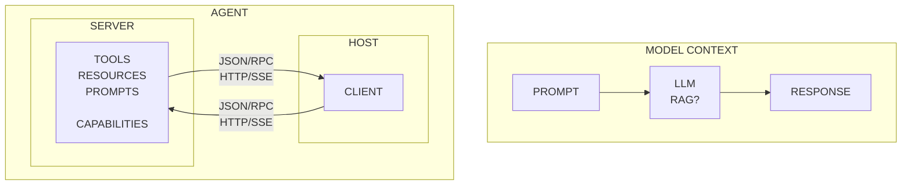

https://www.youtube.com/watch?v=FLpS7OfD5-s

MCP

Prompt => LLM => Response

Response is just words

AI needs to be able to take actions/invoke tools.

You can wrap the LLM with Retrieval Augmented Generation(old)
RAG brings product date into LLM context

Need to get resources into probpt .. DB , CSV, slack etc.

AGENT

HOST applicaiton, uses MCP client to create instance of client

MCP server
- TOols
- Resources
- Capabilities

Can connect Host to server via standard io
or HTTP/SSE in JSON/RPC (SSE persistant connection vs say webhooks)

## Architecture Diagram

MCP
PUT the externals in their own service, i.e. for an event planner, as opposed to putting querying the calendar and yelp and a reservation API into an app, put them in a the server, then other apps can use it.

Prompt " I want to have coffee with Peter next week"

HOST can interogate capabilities of server

Can ask model how to use resources
