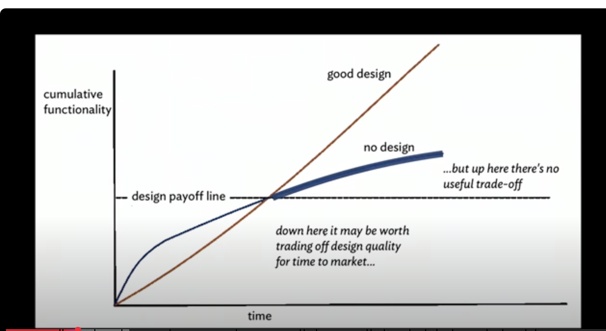
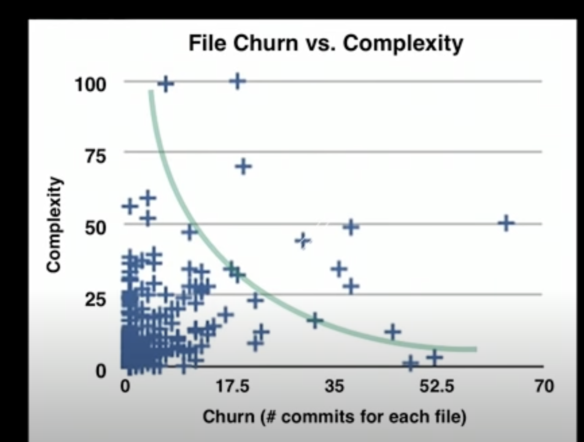

# Polly want a message

## Design Sytamina Hypothesis

Agile: We reward people for how fast they can take something off the backlog and get it done.

Design inflection point.. At start, no design is faster, but slows down over time. Reach a point where sustained development is faster with design.



IRL we do no know this inflection point.

## Procedures VS OO

OO to replace simple procedure is harder.

OO relies on objects, relies on messages, is indirection, indirection makes code harder to understand.

Simple procedures dont scale. Become complex procedueres.

Only worse thing than complex procedure is OO with wrong abstraction.

## Churn v complexity



^^ Indicative of right abstraction. Open closed(abstracted thing that changes is in its own file.)

Death Star: One file with high churn AND complexity
Super important AND complicated

## Exploration in complexity

Demonstration of multiple changes leading a simple procedure to a complex

Easy is the enemy of the simple .. adding steps to procedure

What brought you success will doom you to failure.

## Affordances

Objects that Are
- Anthropomorphic
- Polymorphic
- Loosely Coupled
- Factory Created
- Role Playing
- Message sending

### Anthropomorpic

What an object 'wants'

### Polymorphism

Condition of having many forms
Objects of different types respond to same message

### Role Playing

Anthropomorphic way to say polymorphism. Objects are players of their role, i.e. they respond to the messages of their role.
Different objects that conform to Api, role play, not type they are

### Factory Created

Factories hide the rules for picking the right player of a role.
Separate logic that chooses object from logic that interacts with(sends message) to chosen object.

### Message sending

I know what I want, I trust you how to do it.
Could have been called method centric programming(not OOP)


### Fix old code

Code paths is multiplicative of conditionals

```ruby
class Listing
  def intialize(file_name:, tag: nil, repository: nil, git_cmd: nil, line_numbers: nil, left_justify: false)
    @file_name = file_name
    @tag = tag
    @repository = repository
    @git_cmd = git_cmd
    @line_numbers = line_numbers
    @left_justify = left_justify
  end

  attr_reader :file_name, :tag, :repository, :git_cmd

  def lines
    if git_cmd ### This is a source, 
      git_lines
    else
      file_lines
    end
    subset = if line_numbers
      lines_to_print(all_lines)
    else
      all_lines
    end
    if left_justify
     return justify(subset)
    end
    subset
  end
end
```

Refactor source

```ruby
class FileSource
def lines ... end
end

class GitTagSource
def lines ... end
end
```


Inject source, remove code used for it

```ruby 
  class Listing
  def intialize( source:, line_numbers: nil, left_justify: false)
    @source = source
    @line_numbers = line_numbers
    @left_justify = left_justify
  end

  def lines
    lines = source.lines
    subset = if line_numbers ### This is a subset
      lines_to_print(all_lines)
    else
      all_lines
    end
    if left_justify
     return justify(subset)
    end
    subset
  end
end
```

```ruby
module Subset
  class Everything
    def lines(everything) = everything # as legit a subset as any other subset
  end

  class LineNumber
    def lines(everything) # logic to pull out subset
  end
end
```

```ruby
  class Listing
  def intialize( source:, subsetter:, left_justify: false)
    @source = source
    @subsetter = subsetter
    @left_justify = left_justify
  end

  def lines
    subset = subsetter.lines(source.lines)
    if left_justify
     return justify(subset)
    end
    subset
  end
end
```

```ruby
module Justification
  class None # Key OO concept, we need a default or null, or we are doomed to the conditional

  class BlockLeft
end
```

```ruby
  # this class went from knowing how to choose behavior to knowing how to send message to role playing objects Easier to make a part, easier to change parts, harder to understand whole
  class Listing
  def intialize( source:, subsetter:, justifier:)
    # ...
  end

  def lines
    subset = subsetter.lines(source.lines)
    
    justifier.justify(subset)
  end
end
```

Isolate the thing you want to vary and make objects (open closed)

any initialization is a dependency, and someone injected it .. inject a smarter thing

Dont inject things then supply behavor for them. Inject things smart enough to know their own behavior.
Push conditionals back on the stack


Factories are shared, isolated, ignorable. The one place in code that knows how to pick fight class that goes with data. Someone has to know

People look at new listing "I cant tell what anything does" .. thats kind of the point. We need to trust other objects to play their role as expected. People who say this are sufferers of `Faux O` from dealing with untrustworthy objects.
