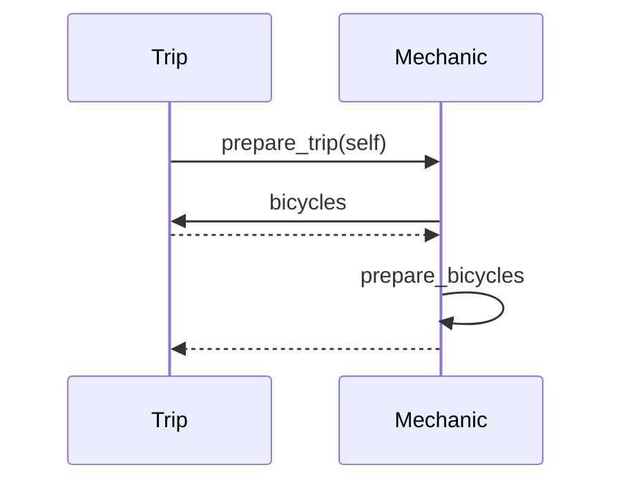
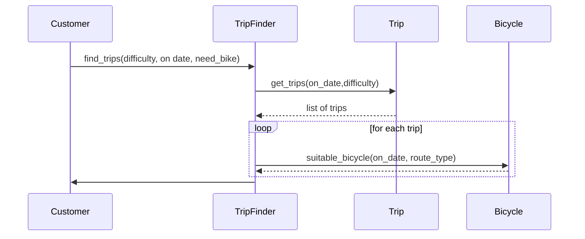
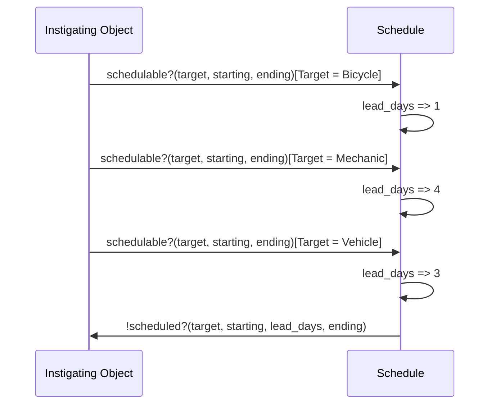
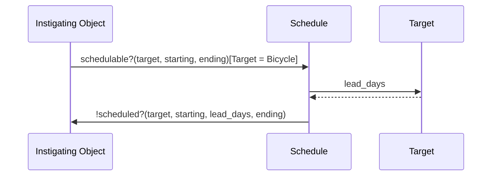
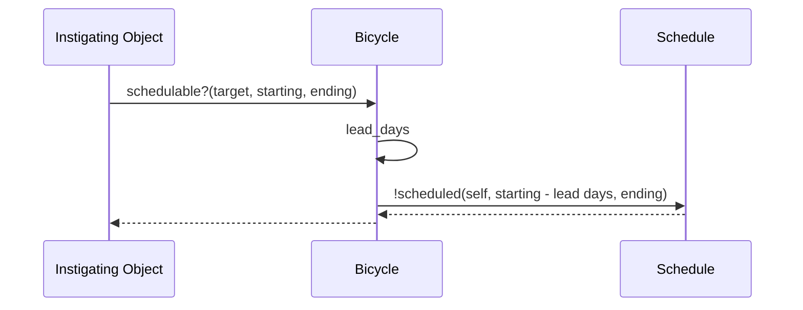
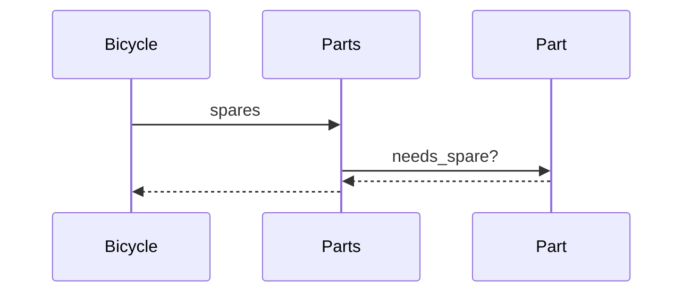

# Practical Object Oriented Design

## CH1 Object Oriented Design

### 1.1 in Praise of Design
If pain was most cost effective we would be obligated to suffer (it isnt, we arent)

#### 1.1 Problem Design solves
If a program written once, does not need to change, design is irrelevent.

Changes introduce friction , they make design matter

#### 1.1.2 Why Change is hard
Objects are connected by the messages that pass between them.
OOP design is about managing dependencies so that objects can tolerate change

In a small application poor design is tolerable, but successful poorly deisgned apps become larger

#### 1.1.3 Practical Definition of Design
Cost of change eventually eclipses cost of develpoment

We design not in anticipation of a given change, but so that our objects are flexible and can tolerate change

### 1.2 Tools of Design

#### 1.2.1 Design Principals
SOLID Design principals
SRP a class has a single responsibility
Open/closed: Open for extension, closed for modification. You can add new functionality without changing existing code
Liskov Subtypes should be suitable replacements for base type
Interface Segregation: Classes should not have to implement methods they do not use
Dependency Inversion: Depend on abstractions, a high level module needs a calss that responds to `#read` not a specific `FileReader` class

Study by NASA ^^^ Are measurable truths that improve code quality

#### 1.2.2 Design Patterns
Outside scope of book

Check out GOF Design Patterns and Head First Design Patterns

### 1.3 The Act of design

Design Patterns and princiapls are like tools, different programmers will use them to craft a solid chair or a rickety stool

#### 1.3.1 How Design fails
Lack of it, ruby is very gentle/permissive

Overdesign: beautiful castles of code that hem you in

Design seperated from programming, design is a progressive discovery based on a feedback loop of programming.

#### 1.3.2 When to Design

Avoid BUFD, because design is a discovery process, BUFD will often deliver the wrong thing. OOD is about arranging code so it may change easily when needed

#### 1.3.3 Judging design

SLOC (old BOO)

Poorly designed applications can rack up impressive design scores (flog), truth is often at intersection of metrics and intuition

Ultimate metric would be "cost per feature over time interval that matters"

When design prevents software from being delivered on time or at all, you have lost

Break even point differs, a novice may never reap benefit of their design an expert later the same day

### 1.4 A Brief Intro to OOP

#### 1.4.1 Procedural languages
Two things: data and behavior
data is packaged into variables and transformed through behavior

#### 1.4.2 Object Oriented Languages
Data and behavior combined into an Object
objects invoke one another's behavior by sending messages

## CH2 Designing classes with a single responsbility
Foundation is message, most visible is class

Must work now, be eassy to change forever

### 2.1  what belongs in a class?

#### 2.1.1 grouping methods into classes

Classes define a virtual world that constrains imagination
Impossible to make right decsion at outset, newver know less than you know now.
Design is about preserving changeability

#### 2.1.2

define easy to change:
- No unexpected side effects
- Small changes in requirements > Small changes in code
- code is reusable
- changes are made by adding code that is easy to change

This becomes TRUE
*T*ransparent: Consequences of change are obvious in code that is changing, and distant code that relies on it.
*R*easonable: Cost of a change is proportional to the benefits conveyed by the change
*U*sable Existing code is reusable in new and unexpected contexts
*E*xemplary. Code should encourage those who change it to perpetuate these qualities

### 2.2 Creating SRP classes
a class should do the smallest thing useful

#### 2.2.1
Nouns as objects in domain represent simpleist candidates for classes 

Present an implementation of a `Gear` that calculates `gear_inches`(bike value)
`def initialize(chainring, cog,rim,tire)`
May be sufficient for simple app, has some obvious problems(why does a gear have a rim and a tire?)

#### 2.2.2 Why SRP matters

Reusable classes are pluggable units of known behavior that few entanglements.
Multiple responsiblities engenders difficulty of reuse, as responsibilites become entangled within class.

#### 2.2.3 Determining if class meets SRP

Rephrase methods as questions i.e. 'Gear, what is your ratio'(reaonable). 'Gear, what is your tire'(unreasonable).

Attempt to describe it in one sentence. If that sentence uses 'Or' it probably has 2, if it uses 'and' it has 2 and the probably aren't related.

Cohesion: every thing a class does relates to its purpose

#### 2.2.4 Determining when to make decisions

When faced with an imperfect design that 'works' ask yourself 'what is the cost of doing nothing today'

With non-exemplary code, there is a chance someone will reuse it's pattern while you wait for better information.

### 2.3 Writing code that embraces change

#### 2.3.1 depend on behavior, not data

Alwats wrap ivars in accessor methods, this means the method is the only place that understands what the underlying behavior does

Hide data structures

`@data = [[1,3], [2,4], [3,5]]` (rim and tire sizes as 2d array)
An implementation like this *knows* too much about the 2d array, it knows rims are at index 0 and tires are at index 1. When you have data in an array, soon you have behavior all over referencing the arrays structure.

```ruby
class RevealingReference
  attr_reader :wheels
  def initialize(data)
    @wheels = wheelify_data(data)
  end

  def diameters
    wheels.collect { |wheel| wheel.rim + (wheel.tire * 2)}
  end

  Wheel = struct.new(:rim, :tire)
  def wheelify_data # All knowledge of data ctructure is consolidated here
    data.collect{ |cell| Wheel.new(cell[0], cell[1])}
  end
end
```

If you need a messy structure, hide the mess from yourself.

#### 2.3.2 use SRP

Seperating interation from the action of each iteration is a common case of breaking down multiple responsibilities

```ruby
# previous diameters

def diameters
    wheels.collect { |wheel| diameter(wheel) }
  end

def diameter(wheel)
  wheel.rim + (wheel.tire * 2)
end
```

Similar issue in `gear_inches

```ruby 
def gear_inches
  ratio * (rim +(tire * 2))
end

### BECOMES

def gear_inches
  ratio * diameter
end

def diameter
  rim + (tire * 2)
end
```
Once isolated it becomes clear diameter contains only things in wheel. This suggests it should be *in* wheel.

Do these refactors even when you dont know ultimate design.

Impact of single refactor is small, but cumulative effect is huge

- Expose previously hidden qualities
- Avoid need for comments
- Encourage reuse
- Are easy to move.

You could add the `def` diameter` to the wheel struct if you didnt want to make a new wheel now.

Hold off on making decisions until you have to. If wheel can be a struct in Gear, thats ok *until* it needs to be its own thing.

## Chapter 3 Managing dependencies

### 3.11 Recognizing dependenices

An obect has a dependency when it knows

- The name of another class
- The name of a message it expects to send to something other than self
- The arguments an external message require
- The order those arguments go in.

### 3.13 Other dependencies

Depending on an external object which in turn depends on *another* external object is an especially bad case because *any* change ot an inetrmediate object can cause the chain to break, Law of demeter, limit this chain to one external dependency.

## 3.2 Writing loosely coupled code

### 3.2.1 Inject dependencies

WWhen we hard code a reference to another class, we are stating we are only willing to deal with that class , making the including class more concrete. Most of the time it is not the *class* that is important, but the method it responds to. 

```ruby
class Gear
  attr_reader :chainring, :cog, :wheel
  def initialize(chainring, cog, wheel)
    @chainring = chainring
    @cog = cog
    @wheel = wheel
  end

  def gear_inches
    ratio * wheel.diameter
  end
end

puts Gear.new(52, 11, Wheel.new(26, 1.5)).gear_inches
```
still question of 'where do we put name dependency'

### 3.22 Isolate Dependencies

Sometimes we are constrained such that we cannot inject dependencies. In this case, isolate them

```ruby
class Gear
  ... same code

  def gear_inches
    ratio * wheel.diameter
  end

  def wheel
    @wheel ||= Wheel.new(rim, tire)
  end
end
```

This has a few benefits, first highlights/exposes Gear's Dependency on Wheel, second, reduces the number of places a change to wheel could affect Gear. If for example, Wheel adds a 3rd argument, It could be added *only* in `Gear#wheel`, vs everywhere a Wheel was instantiated.

### 3.3 Isolate vulnerable external messages

```ruby
def gear_inches
  ### scary math
    foo = intermediate result * diameter
  ### more math
end
def diameter
  wheel.diameter
end

# OR 

delegate :diameter, to: :wheel
```

gear_inches now no longer knows that Wheel responds to diameter. Instead, it sends the diameter method to self. If wheel changes the name or signature of its implementation of diameter, the changes on Gear are confined to the simple wrapping method.

### 3.2.3 Remove argument order dependencies

Use Kwargs. It's quite common to tinker with initialization arguments. If positional arguments are used, each change causes you to  change every place the class is initialized, and can lead you to be unwilling to make changes.

How kwargs support Open/Closed Pricipal:
Open for Extension: You can add new keyword arguments to a method without changing the method's existing interface. This allows you to extend the functionality of the method by accepting additional parameters.

Closed for Modification: Existing code that calls the method does not need to be modified when new keyword arguments are added. The method can handle the new arguments internally, providing default values if necessary.

#### Isolate multiparemeter Initialization

Sometimes you dont controle signatures of methods. when you don't i.e. if using a gem or client external to your application, wrap the external class, i.e.

```ruby
module SomeFramework
  class Gear
    attr_reader :chainring, :wheel, :cog
    def initialize
      @chainring = chainring
      @wheel = wheel
      @cog = cog
    end
  end
end

module GearWrapper
  def self.gear(chainring:, wheel:, cog:)
    SomeFramework::Gear.new(chainring, cog, wheel)
  end
end
```

Type of factory

### 3.3 managing dependency direction

#### 3.3.2 Choosing Dependency direction

- Some classes are more likely to have changes in requirements
- Concrete Classes are more likely to change than abstract classes
- Changing a class with many dependents reuslts in widespread change.

Ruby classes and framework, less likely to change than your code

When gear is changed from depending on a class called wheel to being injected with a class that responds to the method :diameter it became more abstract.
This is a type of interface, in ruby, its really east to do this
In say Java youd have to define an interface, define diameter as part of the interface, include hte interface in Whell, and tell gear the injected class is a kind of that interface.

Abstractions represent common, stable qualities
Abstractions are more stable than concretions, but also harder to grok.

| Column 1 | Less Likely to change | More likely to change |
|----------|----------|----------|
| Many dependents | Abstractions gather here | Danger |
| Few Dependents | safe |  safe, many changes, few consequences |

Heuristic: Depend on things that change less often than you do.


## Chapter 4 Creating flexible interfaces

## 4.1 understanding interfaces

In an application where objects can send any message to any other message, the objects become like an interwoven matt, because objects reveal too much

### 4.2 defining interfaces

*Public interfaces*
- Reveal primary responsibility
- Are expected to be invoked by others
- Do no change on whim
- Are thoroughly documented in tests

*Private Interfaces*
- Handle implementation details
- are unsafe for others to depend on
- may not be references in tests

### 4.3 Finding public interface

Domain objects Present themselves as the first 'thing' to build. They are obvious, because they stand for big real world things.

Sequence Diagrams are a low cost way to experiment with objects and messages.
Sequence Diagrams explicitly specify messages that should pass between objects using their public interfaces.

They invert design conversation to "what object should respond to what message".

### 4.3.4 Ask for what instead of telling how

An implementation of a Trip and Mechanic class where Trip tells Mechanic every step needed to prepare a bicycle is problematic. I.e. "clean bicycle, pump tires, lube chain, etc" Requires Trip to know what Mechanic does. If mechanic adds a new responsibility, Trip will have to be changed in it's algorithm of telling Mechanic *what* to do.

Change it so Trip tells Mechanic `prepare_bicycle` and the mechanic `prepare_bicycle` method takes all the steps needed to prepare a bike.

### 4.3.5 Seek context independence

Things that a class knows about other objects make up its context. Trip expects to hold a mechanic object that response to `prepare_bicycle`

Can't reuse trip without a mechanic-like object

Dependency injection allows objects to collaborate with others without knowing who they are.

At first it seems impossible, Trips need bikes prepared, so a trip needs to ask a mechanic to prepare bikes.


Here, Trip knows it want to be prepared, passes itself to mechanic, mechanic calls back to trip to get bicycles, and prepares them

Here, trip doesnt know or care that is has a mechanic, it merely holds onto an instance which will recieve `prepare_trip` and trusts it to do its job.

### 4.3.6 Trust other objects

If objects were human ' I know what I want, and I trust you to do your part'

### 4.3.7 using Messages to Discover Objects

A customer, in order to choose a trip, would like to a see a list of trips of appropriate difficulty, wiith rental bikes available.

It is perfectly reasonable `Customer` would sent `suitable_trips` it is not reasonable Trip would recieve it ... but what would.. a `TripFinder



Sequence Diagrams make convoluted discussions easy and low cost to change.

### 4.4 Writing code that puts its best interface forward.

It is your interfaces, more than anything, that define your application

### 4.4.1 Create explicit interfaces

goal: Write code that works today and can be easily reused.

Methods in public interface should 
- Be Explicitly identified
- Be More about what than how
- Prefer KWARGS.

Do not test private methods, or segregate the tests.

### 4.4.2 Honor Public Interfaces

If your design forces you to reuse the private interface of anohter class, *first* rethink design.

### 4.4.4 

Construct Public interfaces with an eye toward minimizing context they require.

This could be a new wrapper class, a new method on the oublic interface of a class, or a wrapping method to isolate the dependency in the calling class.

### 4.5 Law of Demeter.

Set of coding rules resulting in loosely coupled objects. (one dot rule)

Below Trip#depart methods

- customer.bicycle.wheel.tire
- customer.bicycle.wheel.rotate
- hash.keys.sort.join(',')

Remember TRUE, transparent, reasonable, usable, exemplary

Above code is not reasonable, if wheel changes, Trip may have to change.

Changing rotate or tire may break something in trip, something far away breaks Trip, not Transparent.

Trip Needs a customer with a bike with a wheel, lots of context, not reusable.

1 is much less worse than 2, query message vs command, in your use case, may be chaper to reach through intermediate objects to grad an attribute. NEVER do this with behavior.

3 is not problematic, it's all the same thing, an Enumerable of Strings.

### 4.5.3 avoiding Demeter violations.

Delegation lets an object intercept a message sent to self and send it elsewhere. 

### 4.5.4 Listen to Demeter

Message chains occur when design is influenced by objects you already know.

Reaching across means "Theres some code I know I want and I know how to get it" Makes your code not only know what it wants, but how to navigate across a bunch of other classes to grab it, drastically increasing your classes knowledge of other objects and coupling it to the current object structure.

Demeter violations are clues that there are objects whose public interface is lacking.

### 4.6

Obecjt oriented applications are defined the messages that pass between them using their public interfaces.

## CH 5 Reducing cost with Duck Typing.

### 5.1 understanding duck types

Class is just one way for object to gain public interface

### 5.1.1 overlooking duck type

At a high level we go from a `Trip` class looking to be prepared. We start with a trip class with a case statement switching on `preparer`'s type. The problem with this implementation Is `Trip` needs to know what preparers are AND how they do it. IT has external dependecies on class names and method names of those classes.

```ruby
class Trip
  attr_reader :bicycles, :customers, :vehicles

  def prepare(preparers)
    preparers.each do |preparer|
      case preparer
      when Mechanic
        preparer.prepare_bicycles(bicycles)
      when TripCoordinator
        preparer.buy_food(customers)
      when Driver
        preparer.gas_up(vehicle)
        preparer.fill_water_tank(vehicle)
    end
  end
end
```

At a high level, Trip's prepare method wants to prepare a trip. The method Trip can send each preparer is `prepare_trip(self)` Objects that implement `prepare_trip` are `Preparers` and objects that interact with preparers need to trust them to implement the `prepare_trip` interface.

NEW DESIGN

```ruby
class Trip
  def prepare(preparers)
    preparers.each{ |preparer| preparer.prepare_trip(self) }
  end
end

class Mechanic
  def prepare_trip(trip)
    trip.bicycles.each { |bike| prepare_bicycle(bicycle)}
  end
end

class TripCoordinator
  def prepare_trip(trip)
    buy_food(trip.customers)
  end
end

# etc. for Driver
```

Initial example depended on concrete class, making it easy to understand, but dependency laden.

Concrete code is easy to understand but costly to change. Abstract code is harder to understand but more flexible. Fundamental tension of OOP.

Polymorphism: Ability of many different objects to respond to the same message. A single message thus has many forms.
Duck typing is one way, inheritance and behavior sharing with modules are another.

### 5.2 Writing code that relies on ducks

### 5.2.1 recognizing hidden ducks

- Case statements that switch on class
- kind_of? and is_a? checks
- responds_to?
- observation `try` is often a hidden switch
- `&.` is a hidden switch on nil

These all indicate you are missing an object with an undiscovered public interface. I doesnt matter that the undiscovered interface is a duck, its the interface that matters, not the class of the object that implements it.

See CH 9 for testing ducks.

### 5.2.5 choose ducks wisely

An example from Rails framework, with type swtiching on nil and array. These core language methods and classes are very stable and unlikely to change, so the check on type here is relatively safe.

### 5.3 conquering fear of duck typing

AFAICT static type checking is the exact opposite of duck typing

Metaprogramming often requires ducktyping as there are many cases when you cannot know what a class will be at runtime.

### 5.4 summary

Messages are at the center of OO applications

Duck types detach these public interfaces from classes. Duck typing reveals underlying abstractions that might be invisible 

Thinking ahead to testing, doing something like writing an Rspec expectation 'is a preparer' asserting members of a duck type respond to a certain interface and including it in the spec files of classes that are also ducks.

## Chapter 6, Inheritance

### 6.1 Classical inheritance

Classical => based on classes, 
Inheritance form of automatic message delegation up the class ancestor chain

### 6.2 When to use inheritance

When a pre-existing class contains most of the behavior you need, its tempting to add a a type swtich. Generally this is a bad idea(caveat *may* be expedient )

This is the behavior inheritance solves: That of highly related types that share common behavior but differ on a dimension.

Nil and String both subclass Object, nil implements `#nil?` as true, while object impements it as `false`. String delegates nil? up to object, while nil does not because the interface is defined.

Subclasses are their superclass AND MORE.

### 6.3 Misapplying inheritance.

### 6.4 Finding the Abstraction.

Subclasses are *specializations* of their superclasses. They should be everything they are PLUS MORE
Inheritance should be used for generalization => specialization relationships.

### 6.4.1 Creatign an abstract super class.

Trying to get a class diagram where both RoadBike and MountainBike subclass Bike.

Abstract: Disassociated from any specific instance.

It might not be right to commit to inheritance with with  2 classes. Might be right to duplicate code. Depends on how much change you anticipate, and how soon you anticiapte a third use case.

Easier to promote code to super class then demote.

When deciding on Refactoring ask the question: What happens if Im wrong.

Failure to promote is obvious, when another sublass needs the behavior, it will be seen. 
*BUT* Failure to demote is worse, creates behavior that is not applicable to all subclasses and subclasses are no longer specializations of their more general superclass.

### 6.4.4 Template method pattern.
Defining a basic structure in the superclass and sending messages to acquire subclass specific contributions is known as template method pattern.

The Initialize here is the template method, Bicycle relys on subclasses to provide reasonable defaults

```ruby
class Bicycle
  attr_reader :size, :chain, :tire_size

  def initialize(**opts)
    @size = opts[:size]
    @chain = opts [:chain] || default chain
    @tire_size = opts[:tire_size] || default_tire_size
  end

  def default_chain ; '10-speed' ; end
end

class RoadBike < Bicycle
  def default_tire_size ; '23' ; end
end

class MoutainBike < Bicycle
  def default_tire_size ; '2.1' ; end
end
```

### 6.4.5 Implementing every template method

Above, Bicycle's `initialize` sends `default_tire_size` but does not implement it. Bicycle imposes a requirement on it's subclasses but does not make it explicit. MAke is explicit

```ruby
class Bicycle
  def default_tire_size
    raise NotImplementedError, "#{self.class} should have implemented"
```

### 6.5 Managing coupling between subclasses and super classes

Having subclasses call super creates a dependency and requires subclasses to know the algorithm. IF the algorithm changes, subclasses may break.

### Decoupling Subclasses useing Hook Methods

```ruby
class Bicycle
  def initialize(**opts)
    @size = opts[:size]
    @chain = opts [:chain] || default chain
    @tire_size = opts[:tire_size] || default_tire_size

    post_initialize(opts)
  end
end

class RoadBike
  def post_intialize(opts)
    @tape_color = opts[:tape_color] # road bike can provide specializationd and overrides
  end
end
```

Road bike no longer knows the algorithm and is more flexible in face of uncertain future.

We can do the same thing with spares.

THIS
```ruby
class Bicycle
  def spares
    {tire_size:, chain:}
  end
end

class RoadBike
  def spares
    super.merge(tape_color:)
  end
end
```

BECOMES THIS
```ruby
class Bicycle
  def spares
    {tire_size:, chain:}.merge(local_spares)
  end

  def local_spares ; {} ; end # Hook for subclasses override
end

class RoadBike
  def local_spares
    {tape_color:}
  end
end
```

Upside of this coding pattern, making another type is blindingly easy, just supply the specializations.
### 6.6 Summary

 Inheritance solves the problem of related types that share a great deal of common behabior but differ alogn a dimension. Allows you to isolate shared code and implement common algorithms in an abstract class , while providing a sturcture that lets subclasses specialize. The best way to create an abstraction is by pushing code up from a concrete subclass.

## CH 7

Inheritance is bad at combining behavior of two existing subclasses

### 7.1 Understanding Roles

Sometimes you need to share behavior orthagonal to the role of a class (I.e. active record)

### 7.1.1 Finding roles

Modules allow objects of different classes to play a common role using shared code.

when an object includes a module, the methods become included via automatic method delegation, This looks the same from the including class' standpoint: message received, not understood, routed, value returned

Objects respond to messages

-They implement
- Objects above it in the heirarchy implement
- Those implemented by included modules
- Thoes implemented by modules included in parent classes

### 7.1.2 organizing responsibilities

Implementation where a schedule knows too much (what target object it recieves in order to schedule it )


Here, schedule checks class to know what value to use. Knowledge doesnt belong in schedule, belongs in class whose name Schedule is checking.

### 7.1.3 

the fact schedule checks many class names to deterimine what value to use for a variable suggests the varaible should be a message to those classes.

Here Schedule does not care about Target's class, but just expects it to respond to message `lead_days`



StringUtils#empty(string) is silly: In OOP why woould an instigator ask StringUtils if a string is empty instead of just asking the string `string#empty`

the above Is similar. The instigator wants to know if an object is scheduleable, but is asking the Schedule rather than the object.

### 7.1.4 Writing the concrete code

Start by picking a concrete class an implementing the `schedulable?` method, then refactor for *all* schedulables.



```ruby
class Bicycle

  def initialize(**opts)
    @schedule = opts[:schedule] || Schedule.new # Inject schedule w/default
  end

  def schedulable?(starting, ending)
    !scheduled(starting - lead_days, ending)
  end

  def scheduled?(starting, ending)
    schedule.scheduled?(self, starting, ending)
  end

  def lead_days
    2
  end

  #...
```

Objects using bicycle no longer need schedule

### 7.1.5 Extract the abstraction

Mechanic and vehicle both need this role.

```ruby
module Scedulable

  def schedule
    @schedule ||= Schedule.new
  end

  def schedulable?(starting, ending)
    !scheduled(starting - lead_days, ending)
  end

  def scheduled?(starting, ending)
    schedule.scheduled?(self, starting, ending)
  end

  # includers may override
  def lead_days
    0 
  end
end
```

Dependency on Schedule removed from Bicycle, isolated in Schedulable module. Similar to inheritance where parent classes must implement methods of their child classes, even if to say 'not implemented' or provide a default.

NEW sequence


code in `Schedule` is the abstraction, uses the template method pattern to invite objects to provide specializtions(`lead_days`) to the algorithm.

Similar to classical inheritence, both rely on automatic message delegation.

### 7.1.6 Looking up methods

Basic model of instances look to their class for methods, then to modules included in that class, then to the parent class then to modules in that class etc.

Modules included in reverse order of module inclusion.

Beware possibility of name collision.

for a more detailed explanation see metaprogramming ruby 4.4 section on eigen classes, over and up model

### 7.2 Writing inheritable code

think about deeply nested inheritance structures bouncing up and down the tree :grimace:

### 7.2.1 Recognize Antipatterns

An object uses such as `type` to determine what message to send to self. Here put common code into adstract superclass and create subclasses for different types

Sending object checks recieving objects class to know what method to send, missing duck type. Codify role as duck, and recievers implement duck type interface, then original object send one message to all recievers

If duck types share behavior as well as interface, place the shared code in a module.

### 7.2.2 Insist on the Abstraction

All code of an abstract superclass apply to ALL subclasses. Module includers use ALL module code

When subclasses raise 'does not implement' they are very close to saying ' i am not a specialization of my super class'

### 7.2.3 Honor the contract

Liskov

Subclasses can be used anywhere a superclass would be, and objects that include modules can interchangeably play the modules role.

### 7.2.4 Use Template Method Pattern

Fundamental coding technique for inheritable code is template method pattern. Abstract code feines algorithms, and concrete inheritors of the abstraction provde specializations by overriding template methods.

### 7.2.5 Preemptively Decouple classes.

Avoid code that sends super, instead use hook methods. Inheritance creates dependencies, super adds additional dependency

### 7.2.6 Create Shallow Heirarchies

Beware Deep Narrow Heirarchies, as they become Deep + wide. Deep heirarchies have long lookup paths (many reasons to change) and people tend to become familiar with just top parent and leaf nodes.

### 7.3 Summary

When a class includes a module, the methods in the module get put in the same lookup path as methods acquired by inheritance. Because the mechanism is the same, the same techniques apply. Use Tempate Method pattern and invite includers to supply specialization

Liskov subtypes substitutable for super types.

# Chapter 8, composition


### 8.1 composing a bicycle of parts

### 8.1.1

Creating a Parts object to hold the responsiblity of parts 

Most of the code in bicycle is related to Spares, move the code over as is into a parts Heirarchy

```ruby
class Parts
  attr_reader :chain, :tire_size

  def initialize(**opts)
    @chain = opts[:chain] || default_chain
    @tire_size = opts[:tire_size] || default_tire_size
  end

  def spares
    { chain:, tire_size: }.merge(local_spares)
  end

  def default_tire_size; raise NotImplementedError; end
  def post_initialize; {}; end
  def default_chain; '11-speed'; end
end

class RoadBikeParts
  attr_reader :tape_color

  def post_initialize(**opts)
    @tape_color = opts[:tape_color]
  end

  def local_spares; {tape_color:}; end
  def default_tire_size; '23'; end
end

class RoadBikeParts
  attr_reader :front_shock, :rear_shock

  def post_initialize(**opts)
    @front_shock = opts[:front_shock]
    @rear_shock = opts[:rear_shock]
  end

  def local_spares; {front_shock:, rear_shock:}; end
  def default_tire_size; '23'; end
end
```

Bicycle is now composed of parts, wich is a inheritence heirarchy. Reveals how little bike code was in bike.

### 8.2 composing Parts object

`Parts` contains `Part`, create it now



Parts now becomes a simple wrapper

```ruby
class Bicycle
  attr_reader :size, :parts

  def initialize(size:, parts:)
    @parts = parts
    @size = size
  end

  def spares
    parts.spares
  end
end

class Parts
  attr_reader :parts

  def initialize(parts)
    @parts = parts
  end

  def spares
    @parts.select { |part| part.needs_spare}
  end
end

class Part
  # attrs/init for name, description, needs_spare
end
```

Old spares returns a hash, new spares returns array of part objects

### 8.2.2 Making Parts more array like

Its odd that spares and parts are different on bicycle, ones is array, one is parts object which does not respond to array methods

A few fixes

- Add only methods neededed to parts i.e. Parts#size = @parts.size
Downside: You will start to think of it as array and need more methods
- Subclass array
Downside, Array methods return arrays, not your suclass

- Extend enumerable and forwardable

```ruby
require 'forwardable'
class Parts
  extend Forwardable
  def_delegators :@parts, :size, :each
  include Enumerable

  def initialize(parts)
    @parts = parts
  end

  def spares; select { |part| part.needs_spare? }; end
end
```

By including the Enumerable module, the Parts class must define an each method, which it does through delegation.
The Enumerable module provides a variety of methods for working with collections, such as map, select, reject, find, reduce, etc.
These methods rely on the each method to iterate over the collection.

Becasue each is delegated to parts, Enumerable defined methods will operate on parts

### 8.3 Manufacturing Parts

Somewhere in the app, something needs to know what parts go in a mountain bike.

Create configs

```ruby
road_cofig = 
[['chain', '11-speed'],
['tire_size', '23']
['tape_color', 'red']]

mountain_cofig = 
[['chain', '11-speed'],
['tire_size', '2.1']
['front_shock', 'Manitou']
['rear_shock', 'Manitou', false]]
```

This 2d array provides no structural information but we understand it, 3rd, optional column for need spare, otherwise use default value of true.

Aside: This seems unnecessary, why not make it a hash so its more understandable at a glance as a single thing, without knowing how the factory works

### 8.3.1 Creating Parts Factory

Factory: An object that manufactures other objects

```ruby
module PartsFactory
  def self.build(congfig:, part_class: Part, parts_class: Parts)
    parts_class.new(
      config.collect do |part_config|
        part_class.new(name: part_config[0], description: part_config[1], needs_spare: part_config.fetch(2,true))
      end
    )
  end
end
```

we now always need to use this factory to build. Factory understands terseness of config array.

Because `Part` is almost only its initialize (outside of the needs spare), we can replace Part with an OpenStruct. We isolate the needs spare logic inside the factory

```ruby
module PartsFactory
  def self.build(congfig:, parts_class: Parts)
    parts_class.new(
      config.collect do |part_config|
        create_part(part_config)
      end
    )
  end

  def self.create_part(part_config)
    OpenStruct.new(name: part_config[0], description: part_config[1], needs_spare: part_config.fetch(2,true))
  end
end
```
(open strct => hash initialization)

### 8.4 Composed bicycle

```ruby
class Bicycle
  attr_reader :size, :parts

  def initialize(size:, parts:)
    @parts = parts
    @size = size
  end

  def spares
    parts.spares
  end
end

require 'forwardable'
class Parts
  extend Forwardable
  def_delegators :@parts, :size, :each
  include Enumerable

  def initialize(parts)
    @parts = parts
  end

  def spares; select { |part| part.needs_spare? }; end
end

module PartsFactory
  def self.build(congfig:, parts_class: Parts)
    parts_class.new(
      config.collect do |part_config|
        create_part(part_config)
      end
    )
  end

  def self.create_part(part_config)
    OpenStruct.new(name: part_config[0], description: part_config[1], needs_spare: part_config.fetch(2,true))
  end
end

road_cofig = 
[['chain', '11-speed'],
['tire_size', '23']
['tape_color', 'red']]

mountain_cofig = 
[['chain', '11-speed'],
['tire_size', '2.1']
['front_shock', 'Manitou']
['rear_shock', 'Manitou', false]]

```

Now that these classes exist, its very easy tocreate a new kind of bike

```ruby
recumbent_config =
[['chain', '9-speed'],
['tire_size', '28']
['flag', 'tall and orange']]
```

Create a new bike by describing its parts

Aggregation: Parts of composed object have independent life, I.e. a department has teachers but if department dissolved teachers still exist. 
VS
Strict composition: parts dont have independent life, I.e. a meal and its appetizer, If the meal is eaten, the appetizer is also gone.

Little practical difference, use composition unless more specificity needed.

### 8.5 Choosing Inheritence or Composition IMPORTANT

Inheritence : For the cost of arranging objects in a heirarchy, you get delegation for free

Composition: For the cost of explicit message delegation, you get objects with structural independence

### 8.5.1 Accepting Costs of Inheritance

Code should be transparent, reasonable, usable, exemplary

When it works well
reasonable: Methods at top of heirarchy have widespread influence, position at top of heirarchy is a lever, allowing wide changes minimal code

usable: follows open-closed, adding new subclasses to create new varaints

exemplary: heirarchy embodies abstraction, new subclasses plug in concrete differences, easy to follow
i.e. Numeric(superclass), Int and Float

Costs:

When you model the wrong heirarchy, or others(including future self) want the behavior created but cant accpet the demands of inheritance

Inverse of reasonable: Cost of making chnge at top of incorrect heirarchy

Flipside usable: Inability to add behavior when sublcasses are a mix of types

Flipside exemplary: novices extending incorrectly modeled heirarchies. They need to be refactored, but the person using them lacks the skill to do so.

Inheritence: deep set of dependencies, Strength and weekness. Subclasses are bound to to classes above them.

Do not make external users subclass your code.

### 8.5.2 Accepting Costs of Compositon

composed objects do not depend on structure of class heirarchy and delegate thier own messages

transparency: small objects follow SRP and are easy to change/test. No heirarchy => no inheritance => less affected by others changing

reasonable: composed objects deal with other objects by interface, adding a new variant => add a new object that honors interface

usable: small, structurally independent with well defined interfaces

High tolerance of change.

Costs:

flipside transparent: While each piece is easily understandable, the whole may not be

cost of structural independence: automatic message delegation composed object must know what to delegate to who. Identical delegation may be needed by many objects.

Excellent at objects made of parts, less so arranging code for collection of near identical parts

### 8.5.3 Choosing relationships

Use Inheritence for `Is a` relationships
- small sets of realworld objects that fall naturally into static heirarchies

Use Duck types for `Behaves Like` relationships

- objects that play a role, prepareable, schedulable, etc. Roles are not main responsibility
- recognize role, define interface for every possible player
- if just interface, duck type, if behavior, module

Use composition for `Has a` relationships

- bicycle is more than sum of parts, has parts

### 8.6 Summary

Composition lets you combine small parts, individually easy to test, can lose forest for trees

Inheritance, Composition, modules are competing ways of organizing code

Tools, practice each of them.

### Chapter 9 Testing

Changible code - 3 legged stool

- Writing Object Oriented Code
- being good at refactoring (small deliberate steps)
  Defer decisions until necessary
- Having the right tests

### 9.1 Intentional testing

True purpose of testing: Reduce costs
Tests are painful? Dont stop .. write better tests

Finding Bugs: Unit tests, fixing bugs early always lowers cost

Supplying Documentation: Provide truest description of your code works

Deferring Design Decisions: Allow Concrete 'hacks' to support certain use cases behind presentable public interfaces for classes. An abstraction may be forthcoming, but as of now you lack info to make it correctly

Supporting Abstractions: Good design progresses towards small comunicating objects. Downside of these is you can lose how the whole functions. There is a level of abstraction where code is almost impossible to change without good tests.

Exposing Design Flaws: If the tests require too much setup.. the objects have too much context.

### 9.1.2 knowing what to test

See sandi_metz/magic_tricks_of_testing_metz.md For a better explanation of this section.

| Message | Query | Command |
| -------- | -------- | -------- |
| Incoming   | Assert Result   | Assert Direct public side effect   |
| Sent to self  | Ignore   | Ignore |
| Outgoing   | Ignore   | Expect to send verified double   |

### 9.1.3 Knowing when to test

Writing tests requires a modicum of reusability because tests are reuse.

Dont use inflated self view as an excuse to skip tests.

### Knowing How to test

TDD and BDD are best seen as a continuum wheere values and experience dictate where you stand.

Strong personal preference BDD .. Write the request spec, get it to the right response, see how the objects communicate
- May be governed by the fact the code base has a lot of accidental complexity

Test only the object under test, sight tests along the boundaries of its messages.
If you put tests *inside* the object(testing private methods) it allows knowledge that should be internal to the object to leak into the test.

### 9.2 Testing incoming messages.

### 9.2.1  Delete unused interfaces

The one caveat to testing every incoming message, is if there no dependents, dont test the method. Delete it. It is a speculative method. Easier to retrieve code then live with unused code.

### 9.2.2 Proving Public interface.

Incoming messages are tested by asserting about the value or state the message returns

Very straightforward when does not collaborate with ohter objects

```ruby
class Gear
  def gear_inches
    ratio * Wheel.new(rim, tire).diameter
  end
end
def test_calculates_gear_inches
  gear = Gear.new(chainring: 52, cog: 11, tim: 26, tire: 1.5)

  assert_in_delta(131.7, gear.gear_inches, 0.01)
end
```
Gear and wheel tighly coupled, testing gear effectively tests wheel

Aside: See patrick_duvall/musings/factories_and_objects_under_test.md

### 9.2.3 Isolating object under test

Cant test gear in isolation (test is first reuse of code)

resolution(From CH3): Inject Diameterizable into Gear. Temping to inject wheel if wheel is only player of role Diameterizable

i.e. 

```ruby
class Gear
  def initialize(chainring:, cog:, wheel:)
    @chainring = chainring
    @cog = cog
    @wheel = wheel
  end

  def gear_inches
    ratio * wheel.diameter
  end
end

def test_calculates_gear_inches
  gear = Gear.new(chainring: 52, cog: 11, wheel: Wheel.new(26, 1.5))

  assert_in_delta(131.7, gear.gear_inches, 0.01)
end
```

Nothing explicitly calls Wheel as playing role of Diameterizable

### 9.2.4 Injecting Dependencies using classes

Imagine someone renames wheel#diameter => wheel#width

Gear spec fails (no surprise). This should happen with 2 concrete collaborators

What if dozens of players of Diameterizable? What if Diameterizables are costly to make?

Common sense: If wheel is only diameterizable and fast enough, do above.

### 9.2.5 Injecting dependencies as role.

Diameterizable is abstraction of idea disparate objects have diameters.

Point of dependency injection: substitute concrete classes without changing code (Open Closed)

When role has single player, that one concrete player and abstract role have blurred line

Creating test doubles: Instance of role player used only for testing

```ruby
class DiameterDouble
  def diameter = 10
end
```
Stubs Diameter so gear test can pass. Fast and Isolated

Problem!!! Change wheel#diameter => wheel#width again: tests fail

DiameterDouble is a second player of the Diameterizable role. Almost invisible
Aside: use verified_doubles in rsepc to avoid this drift

Half solution. Not sharable with other Diametrizables And wheels assertion does not prevent DiameterDouble's drift.
```ruby
class WheelTest
  def test_implements_diameterizable_interface
    assert_respond_to(@wheel, :diameter)
  end
end
```

### 9.3 Testing Private methods

Ideally dont. Private methods are hidden inside object under test and should not be seen by others. Private methods should be invoked by public methods, and these methods should be tested.

Private methods are unstable ans should be able to change without breaking tests if object public methods dont change.
Testing is documentation and encourages others to break encapsulation  and depend on these methods

### 9.3.2 Remove private methods entirely

This option sidesteps the problem

### 9.3.3 choosing to test a private method

When a concrete hack is in place as a means to refactorign it out later
When legacy code has complicated private internals and you want to change them.

Aside: Occasionally I will write private method tests with comments about being able to remove them if they become cumbersome.

### 9.4 Testing Outgoing messages

### 9.4.1 Ignoring Query Messages

One classes outgoing query message is anothers incoming query message. Write expectations for the class where the query is incoming.

### 9.4.2 Proving Command Messages

Sometimes it *does* matter a message gets sent(something happens as a result). In this case, the object under test needs to test the message is sent.

Lets say we have a model that makes a call to an service object, in the model test, write the expectation that the service object recieved the call with the correct arguments. DO NOT test the result of the service object call in the model test. (I.e. Invoice enqueueing mail)

### 9.5 Testing Duck types

Revisting preparers

```ruby
class Trip
  def prepare(preparers)
    preparers.each{ |preparer| preparer.prepare_trip(self) }
  end
end

class Mechanic
  def prepare_trip(trip)
    trip.bicycles.each { |bike| prepare_bicycle(bicycle)}
  end
end

class TripCoordinator
  def prepare_trip(trip)
    buy_food(trip.customers)
  end
end

# etc. for Driver
```

We can then write a test that each player of the role preparer responds to its correct interface

```ruby
module PreparerInterfaceTest
  def test_implements_the_preparer_interface
    assert_responsd_to(@object, :prepare_trip)
  end
end

class MechanicTest
  include PreparerInterfaceTest # include in every instance of a preparer

  def setup ; @object = @mechanic = Mechanic.new ; end
end
```

Additionally, write a test for the Trip that it sends the correct outgoing message to its preparers.

Here, we can include the test interface test inside the double so that we do not end up in the "Living the Dream" Problem where mocks respond to objects that the implementation code does not. (In Rspec, verified doubles ensure mocks respond to the same methods as the objects they are mocking.)

This code is my attempt at a syntesis of the two versions of code in the chapter. The book uses a `Minitest::Mock` which did not seem to be able to verify the mock responds to the same 

```ruby
class PreparerDouble
  attr_reader :recieved_trip

  def prepare_trip(trip) ; end
end

class PreparerDoubleTest
  include PreparerInterfaceTest

  @object = PreparerDouble.new
end

class TripTest
  def requests_trip_preparation
    preparer = PreparerDouble.new
    trip = Trip.new([], [], []) #bikes, customers, vehicles

    trip.prepare([preparer])

     assert_equal trip, preparer.received_trip, "Expected preparer to receive the trip object"
  end
end
```

In Rspec, I would probably jsut pass in a verified double of a preparer to trip. It feels a little Java like in that we have a module functioning as an interface.

Here is another implementation that creates a module to define the role. Im not sure it's better. I like the explicitness of a module defining the role

```ruby
module Preparer
  def prepare_trip(trip)
    raise NotImplementedError, "#{self.class} must implement #prepare_trip"
  end
end

class Mechanic
  include Preparer

  def prepare_trip(trip)
    trip.bicycles.each { |bike| prepare_bicycle(bike) }
  end

  def prepare_bicycle(bike)
    # Mechanic-specific logic
  end
end

class Trip
  def initialize(bicycles, customers, vehicles)
    @bicycles = bicycles
    @customers = customers
    @vehicles = vehicles
  end

  def prepare(preparers)
    preparers.each { |preparer| preparer.prepare_trip(self) }
  end
end
```

Tests

```ruby
RSpec.shared_examples "a preparer" do
  it "responds to #prepare_trip" do
    expect(subject).to respond_to(:prepare_trip)
  end
end

RSpec.describe Mechanic do
  it_behaves_like "a preparer"
end

RSpec.describe Trip do
  it "sends #prepare_trip to each preparer" do
    preparer = instance_double("Preparer")
    allow(preparer).to receive(:prepare_trip)

    trip = Trip.new([], [], [])
    trip.prepare([preparer])

    expect(preparer).to have_received(:prepare_trip).with(trip)
  end
end
```

The shared example ensures that any object playing the preparer role responds to the `prepare_trip` method, while the `instance_double` ensures that the double adheres to the Preparer interface (if interface changes, test will fail.)

### 9.6 Testing inherited code
Refer to CH6 bicycle using inheritence

First goal is to ensure all objects honor Liskov Heirarchy. Easy way is to write shared test for common contract and include in every object

```ruby
Module BicycleInterfaceTest
  def test_responds_to_default_tire_size
    assert_respond_to(@object, :default_tire_size)
  end

  def test_responds_to_default_chain
    assert_respond_to(@object, :default_chain)
  end

  # Rest of class contract assertions
end
```
Any object that passes this test can be trusted to act like a `Bicycle`

Usage
```ruby
class RoadBikeTest < Minitest::Test
  include BicycleInterfaceTest
  def setup; @bike = @object = RoadBike.new; end
end
```

#### 9.6.2 Specifying subclass responsiblities

Abstract Bicycle superclass also imposes requirements on subclasses.

```ruby
Module BicycleSubclassTest
  def test_responds_to_post_initialize
    assert_respond_to(@object, :post_initialize)
  end

  # also local spares and default_tire_size
end
```

This test codifies requirements for subclasses of Bicycle. subclasses can still inherit these methods, this test makes sure sublasses do not make these messages fail. Subclass MUST implement `default_tire_size` because abstract superclass raises an error.

Every Bicycle subclass can include these 2 modules
```ruby
class MountainBikeTest < Minitest::Test
    include BicycleInterfaceTest
    include BicycleSubclassTest
  def setup; @bike = @object = MountainBike.new; end
end
```

#### Confirming SUperclass enforcement

Bicycle raises error if subclass does not implement `default_tire_size`. Implementation is in subclass, but enforcement in `Bicycle`, ergo test in Bicycle.

```ruby
class BicycleTest < Minitest::Test
  def setup; @bike = @object = Bicycle.new(tire_size: 0); end

  def test_forces_subclasses_to_implement_default_tire_size
    assert_raises(NotImplementedError(@bike.default_tire_size))
  end
end
```

Aside: I would probably do somehting like below in Bicycle Initialization to avoid instantiating the abstraction
```ruby
raise NotImplementedError, "Bicycle is an abstract class and cannot be instantiated directly" if self.class == Bicycle
```

### 9.6.3 Testing Unique behavior

Now that common behavior is tested, 2 gaps remain: specializations, both from subclasses and superclass.

Shared modules test *most* RoadBike behavior. Only thing left here to test is RoadBike Specialiazation.

```ruby
class RoadBikeTest < Minitest::Test
  include BicycleInterfaceTest
  include BicycleSubclassTest
  def setup; @bike = @object = RoadBike.new(taape_color: red); end

  def test_puts_tape_color_in_local_spares
    assert_equal 'red', @bike.local_spares[:tape_color]
  end
end
```

#### Testing Abstract Superclass Behavior

Bicycles are not meant to be created, testing it can be hard.

Because Bicycle used template methods for concrete specializations we can manufacture a test double for Bicycle

Can be convenient to still be able to create abstract Bicycle(As I read this, perhaps my above Aside was too strict, rely on tests to enforce behavior vs code. Still on the fence)

```ruby
class BikeDouble < Bicycle
  def default_tire_size = 0
  def local_spares = { saddle: 'painful' }
end

class BicycleTest < Minitest::Test
  def setup
    @bike = @object = Bicycle.new(tire_size: 0)
    @double = BikeDouble.new
  end

  def test_forces_subclasses_to_implement_default_tire_size # Helpful use of instantiating abstract class
    assert_raises(NotImplementedError(@bike.default_tire_size))
  end

  def test_include_local_sparess_in_spares
    assert_equal @double.spares, { tire_size: 0, chain: '11-speed', saddle: 'painful' }
  end
end
```

Can create a subclass for stubs as long as it doesnt violate Liskov

To prevent Bike double method drift you can write a `BikeDouble` test and include the `BicycleSubclassTest`

```ruby
class BikeDoubleTest < Minitest::Test
  include BicycleSubclassTest
  def setup; @object = BikeDouble.new; end
end
```

To test inehritence Heirarchies
- Write one shareable test for overall interface
- Write one shareable test for subclass responsibilities
- Write subclass specialization specs
- Write Specialization specs for superclass